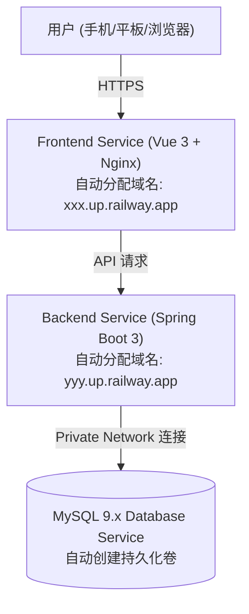

# N-Check 在 Railway 云平台的一键部署全流程指南

本指南手把手教你如何将 **N-Check (名企面经收纳站)** 部署到 **Railway (https://railway.app)** 平台，实现**云端全天候可用、手机/平板/电脑随时随地刷题背八股**。

---

## 一、 Railway 云端架构拓扑

在 Railway 上，你只需要创建 **1 个 Project**，里面包含 **3 个服务节点**：



---

## 二、 准备工作：已就绪的部署配置文件

已在本地为你配置好以下生产级容器文件：
- **后端配置**：
  - [end/Dockerfile](file:///d:/N-Check/end/Dockerfile)：多阶段构建，采用 Eclipse Temurin JRE 17，JVM 堆内存限制为 384MB（`-Xms128m -Xmx384m`），防止容器超限；
  - [end/src/main/resources/application.yml](file:///d:/N-Check/end/src/main/resources/application.yml)：已支持自动从 Railway 注入的 `MYSQLHOST`, `MYSQLUSER`, `MYSQLPASSWORD`, `MYSQLDATABASE`, `PORT` 环境变量中读取配置。
- **前端配置**：
  - [front/Dockerfile](file:///d:/N-Check/front/Dockerfile)：多阶段构建，Node 20 打包 + Nginx 提供静态资源与 Gzip 加速；
  - [front/nginx.conf](file:///d:/N-Check/front/nginx.conf)：单页路由 SPA 重写与代理配置；
  - [front/src/utils/request.js](file:///d:/N-Check/front/src/utils/request.js)：已支持读取 `VITE_API_BASE_URL` 独立后端域名。

---

## 三、 Step-by-Step 部署步骤

### 步骤 1：将代码推送到你的 GitHub 仓库
在本地打开终端，执行 Git 提交并推送到你的 GitHub 私有/公开仓库：
```bash
git init
git add .
git commit -m "feat: N-Check full stack project ready for Railway"
git branch -M main
git remote add origin https://github.com/<你的用户名>/<你的仓库名>.git
git push -u origin main
```

---

### 步骤 2：在 Railway 创建项目并添加 MySQL 数据库
1. 登录 [Railway 控制台 (railway.app)](https://railway.app)；
2. 点击 **`+ New Project`**；
3. 选择 **`Provision MySQL`**（一键创建 MySQL 数据库服务）；
4. 创建完成后，你会看到一个名为 **MySQL** 的数据库卡片。

---

### 步骤 3：部署后端服务 (`end`)
1. 在同一个 Railway 项目画板中，点击右上角 **`+ Create`** 或 **`+ New`**；
2. 选择 **`GitHub Repo`**，选择你刚刚推送的仓库；
3. **关键配置（点击该 Service -> `Settings`）**：
   - **Service Name**：改名为 `ncheck-backend`；
   - **Root Directory**：填写 **`end`**；
   - **Build & Deploy**：Railway 会自动识别并使用 `end/Dockerfile` 进行构建。
4. **绑定数据库环境变量（`Variables` 标签页）**：
   - 点击 **`Add Reference`**（或手动添加），将刚刚创建的 MySQL 服务的变量关联过来：
     - `MYSQLHOST` = `${{MySQL.MYSQLHOST}}`
     - `MYSQLPORT` = `${{MySQL.MYSQLPORT}}`
     - `MYSQLUSER` = `${{MySQL.MYSQLUSER}}`
     - `MYSQLPASSWORD` = `${{MySQL.MYSQLPASSWORD}}`
     - `MYSQLDATABASE` = `${{MySQL.MYSQLDATABASE}}`
5. **生成后端公网域名（`Networking` 标签页）**：
   - 点击 **`Generate Domain`**，Railway 会为你分配一个后端域名（如 `ncheck-backend-production.up.railway.app`）。
   - 记录下这个域名，**加上 https:// 即为你的后端 API 地址**（例如 `https://ncheck-backend-production.up.railway.app`）。
6. **Flyway 自动执行**：后端首次启动时，Flyway 会自动在云端 MySQL 中创建表并初始化默认管理员账号：
   - **账号**：`admin`
   - **密码**：`123456`

---

### 步骤 4：部署前端服务 (`front`)
1. 再次点击右上角 **`+ Create`** -> **`GitHub Repo`**，选择同一个仓库；
2. **关键配置（点击该 Service -> `Settings`）**：
   - **Service Name**：改名为 `ncheck-frontend`；
   - **Root Directory**：填写 **`front`**；
3. **注入后端 API 域名（`Variables` 标签页）**：
   - 点击 **`+ New Variable`**，添加：
     - `VITE_API_BASE_URL` = `https://<你的后端域名>`（填写步骤 3 生成的后端完整地址，如 `https://ncheck-backend-production.up.railway.app`）
4. **生成前端公网域名（`Networking` 标签页）**：
   - 点击 **`Generate Domain`**，Railway 会为你生成前端访问域名（例如 `https://ncheck-frontend-production.up.railway.app`）。

---

## 四、 验证与使用

1. 在手机或电脑浏览器中直接打开前端生成的域名（`https://ncheck-frontend-xxx.up.railway.app`）；
2. 页面会自动跳转至登录页；
3. 输入账号 **`admin`**，密码 **`123456`** 登录；
4. 登录成功后，即可在任意设备上随时随地添加企业、录入八股与算法题解、进行模拟面试抽题！

---

## 五、 个人使用成本与注意事项

- **免维护性**：Railway 会自动为你配置免费 SSL 证书（HTTPS），并支持 Git push 自动触发持续集成部署（CI/CD）；
- **内存优化**：后端容器已严格限制内存上限（JVM `-Xmx384m`），单人正常使用每月资源消耗极低，在 Railway 免费/低门槛额度内轻松运行。
